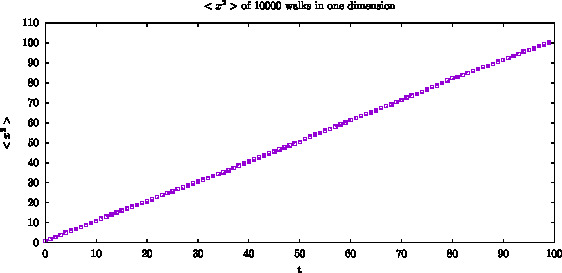
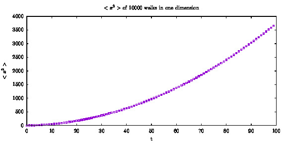
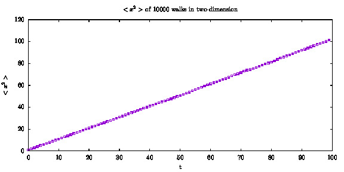
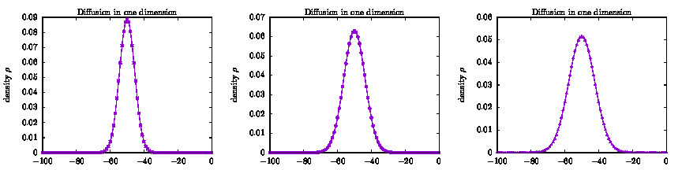
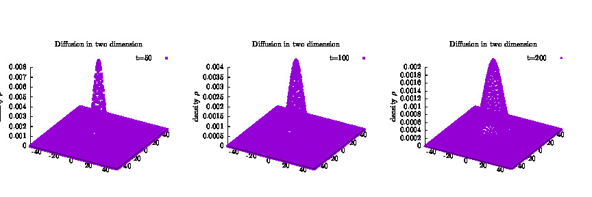
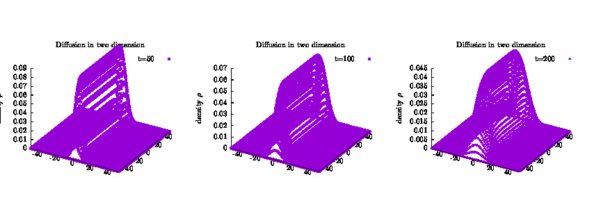

## 
Random Walking and Diffusion

### 
 姓名: 张旨翰 学号: 2014301020035  班级: 2014 弘毅班 

## I 背景介绍
物理学中有一些系统, 是确定性的系统, 它们由某些准确的数学模型加上边界条件所描述, 比如谐振子, 它们有唯一确定解. 而有另一些物理系统, 它们不能用准确的表达式描述, 其中, 随机性扮演着非常重要的角色, 这类系统一般成为 **随机系统**. 这类系统, 一个明显的特征就是拥有非常多的自由度, 或者与粒子数相关, 或者与自旋相关.

随机系统的随机性来自很多方面, 有可能因为无法同时确定所有粒子的位置和速度, 有可能因为外部作用力非常复杂, 而只能用概率来描述, 等等. 因而, 尽管这些系统背后的物理是确定的, 但由于对系统无法完全掌握, 我们只能得出一个统计性或者随机的描述.

一个代表性的随机问题是扩散问题, 另一个简单的是醉汉行走问题. 为了了解随机背后的规律, 我们需要做大量的实验, 对于这些随机问题, 我们可以用计算机模拟大量实验, 省去真实实验的麻烦.

醉汉行走 或者随机行走问题, 一般的描述为, 一个位于某一点的粒子, 每次以一定的概率前进或后退, 两者概率不需相同,步长也不一定一样, 这是一维的情况, 高维的情况与之类似.

## II 随机行走

### II.A 一维等概率等步长随机行走
对于一个典型的一维问题, 我们假设 粒子初始位于 x=0, 步长 为1, 前进后退概率均为0.5. 为了减小涨落, 我们进行 N=10000 次的行走, 观察平均距离平方的行为, 如下面结果所示.

可以看出, 两者之间呈线性关系.这种线性关系在一维扩散系统中也有出现，表明这个随机行走的过程是“类扩散的”。步长为1的情况下, ratio 近似为1.

### II.B 一维不等概率等步长随机行走
假定前进的概率为 p1, 不同 p1 下, 其相关性不再是近似线性相关的.

**p1=0.8**的情况

**p1=0.2**的情况

当两者不相等时, 距离平方与时间平方近似成正比关系.

### II.C 二维随机行走
二维情况下的随机行走, 其行为与一维情况下一样, 当概率相等时, 线性相关, 当不相等时, 与时间平方近似线性相关. 如下

三微情况下亦是如此.

## III 扩散问题
扩散问题实质上等同于随机行走问题. 这里我们也详细探索这一关联.

III.A 一维扩散问题

扩散系统用侅姆霍兹方程描述, 在模拟上, 就转为有限差分版的扩散方程. 在一维情况下, 我们可以观测到, 随时剑变化, 其概率密度有如下变化.

概率密度分布是高斯型的, 而且宽度是与时间相关的, 扩散时间越长, 波形越扁, 这与我们通常的认知是符合的.

### III.B 二维扩散问题
一维扩散问题比较简单, 扩展到二维也比较容易.

在初始只有中心位置有分布的情况下, 其扩散行为如下:

作为对比, 假设扩散源均匀分布在一条中轴线上, 其扩散行为如下:

## IV 结论
在本文中, 我们研究了不同维度下不同概率下的随机行走问题, 发现在等概率下, 行走的距离平方与时间近似正比关系, 而不等概率下, 近似与时间平方呈正比关系. 同时也研究了随机行走与扩散问题之间的联系, 和不同维度下的扩散行为, 其与通常的认识是相符的.

## IV 参考文献
1.计算物理 Nicholas J.Giordano, Hisao Nakanishi
